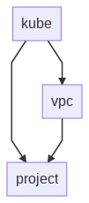

# Instructions

1. Read the blog [GCP Kubernetes Exercise](https://www.karimarttila.fi/gcp/2020/11/28/gcp-kubernetes-exercise.html).
2. Create Admin project and SA in the [init](init) directory.
3. Use Terraform to create modules in the [terraform](terraform) directory. Order of creation: project, vpc, kube.

